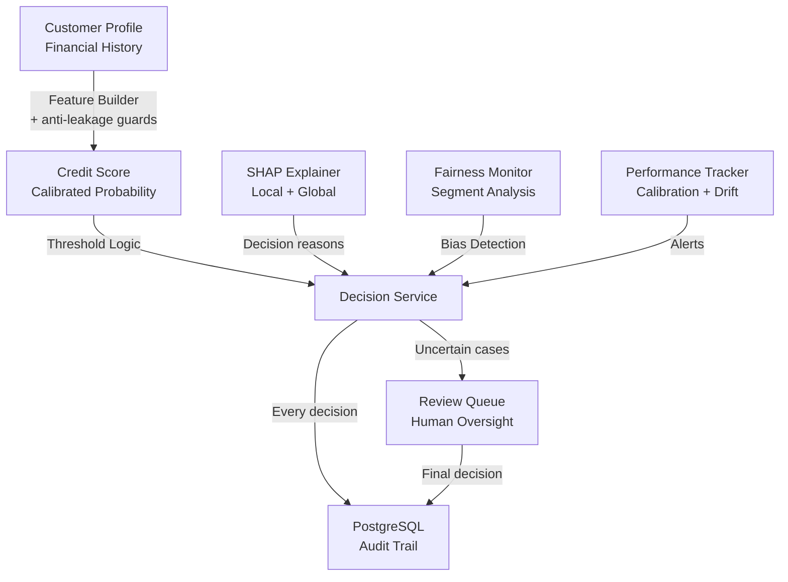

<div align="center">

# Kóllëre — Credit Intelligence

**Explainable, auditable credit decisions for West African microfinance (SFD).**

*Kóllëre* (Wolof): the bond of trust between people — the foundation of every loan.

[](https://github.com/Sow221/kollere-credit-intelligence/actions)


[](LICENSE)

[Live API](https://API_URL/docs) · [Architecture](#system-architecture) · [Results](#experimental-results) · [Author](#author)

</div>

---

## The Problem

Microfinance institutions (SFD) in the WAEMU zone serve the clients banks don't: informal workers, small traders, rural households. Most of them have a **thin credit file** — little or no formal repayment history.

This creates two costly failure modes:

- **Good clients are rejected** because there is no data to prove they are creditworthy.
- **Decisions are manual and hard to audit** — the institution cannot explain *why* a loan was approved or refused, to the client or to the supervisor.

A raw risk score does not solve this. A loan officer needs a **decision**, a **reason**, and the **right to override it**.

## The Solution

Kóllëre turns a default probability into an explainable, auditable lending decision — with a human in the loop.

| Step | What happens |
|------|--------------|
| **Score** | Calibrated XGBoost estimates the probability of default |
| **Explain** | SHAP shows the factors driving each individual decision |
| **Decide** | Decision engine maps score + profile → `APPROVAL · REVIEW · ADJUSTMENT · REJECTION` |
| **Escalate** | Uncertain or thin-file cases go to a human review queue |
| **Audit** | Every decision is logged with its model version, inputs and explanation |

## System Architecture



## Example: A Thin-File Client

A market trader with no prior formal loan applies for 500,000 FCFA. A pure score would reject her for lack of history. Kóllëre routes her to a human, with the evidence needed to decide.

**Request**

```bash
curl -X POST https://API_URL/v1/score \
  -H "Content-Type: application/json" \
  -d '{
        "client_id": "SFD-0001",
        "loan_amount": 500000,
        "loan_term_months": 12,
        "sector": "retail_trade",
        "credit_history_months": 0,
        "monthly_income_estimate": 180000,
        "savings_regularity": 0.92,
        "group_guarantee": true
      }'
```

**Response**

```json
{
  "decision": "REVIEW",
  "probability_default": 0.14,
  "confidence_band": [0.11, 0.18],
  "thin_file": true,
  "top_factors": [
    { "feature": "savings_regularity",    "impact": -0.31, "direction": "reduces risk" },
    { "feature": "group_guarantee",       "impact": -0.18, "direction": "reduces risk" },
    { "feature": "credit_history_months", "impact":  0.22, "direction": "increases risk" }
  ],
  "reason": "Thin credit file: risk is moderate but uncertain. Strong savings behaviour and group guarantee support approval. Human review recommended.",
  "model_version": "xgb-calibrated@v2",
  "decision_id": "dec_2026_000123"
}
```

> Illustrative example on synthetic data. Every response carries a `decision_id` and a `model_version`, so any decision can be traced back and audited.

## Quick Start

```bash
# Using uv (Python environment manager)
uv sync --extra dev --extra test

# Validate anti-leakage guards
uv run pytest tests/ -q

# Run full pipeline (DVC reproducible)
uv run dvc repro

# Start API locally
uv run uvicorn cifci.api.app:app --reload
# API available at http://127.0.0.1:8000/docs
```

Docker alternative:

```bash
docker compose up -d
```

## Tech Stack

| Layer | Technology |
|-------|------------|
| Language | Python 3.11 |
| ML Framework | scikit-learn, XGBoost |
| Calibration | Isotonic regression |
| Explainability | SHAP (local + global) |
| Validation | Temporal split, stratified bootstrap, 95% CI |
| Model Registry | MLflow (Tracking + Model Registry) |
| API | FastAPI + Uvicorn |
| Storage | PostgreSQL (decision log) |
| Workflow Orchestration | DVC |
| Data Versioning | DVC |
| Quality Assurance | pytest, ruff, mypy, pre-commit |
| CI/CD | GitHub Actions |

## Key Features

- **Scoring Engine**: XGBoost probability estimate for credit default
- **Calibration**: isotonic regression ensures probabilities can be read as real risk levels
- **Decision Logic**: risk score + profile → `APPROVAL · REVIEW · ADJUSTMENT · REJECTION`
- **Explainability**: SHAP contributions — global importance and per-decision reasons
- **Thin-File Handling**: dedicated treatment and validation for clients with limited credit history
- **Fairness by Design**: segment-level metrics with 95% CI (see [Fairness](#fairness))
- **Cost Optimization**: thresholds tuned to review-team capacity and the cost of a bad loan
- **Governance**: human review gates, audit trail, versioned models with rollback

## Repository Structure

```
src/cifci/
├── data/               # Data ingestion and synthetic generation
├── features/           # Feature engineering + anti-leakage guards
├── models/             # Training, calibration, registry
├── evaluate/           # Metrics, bootstrap CI, fairness analysis
├── decision/           # Decision engine logic
├── explain/            # SHAP explanations (local + global)
├── pipeline/           # DVC and CLI orchestration
├── api/                # FastAPI scoring service
└── cli/                # Command-line tools
tests/                  # Unit and integration tests
configs/params.yaml     # Centralized parameters
dvc.yaml                # DVC pipeline definition
data/                   # Data (DVC-tracked)
models/                 # Model registry (DVC-tracked)
reports/                # Generated audit reports
docs/                   # Protocols and validation documentation
.github/workflows/      # CI/CD (ruff, mypy, pytest, anti-leakage)
```

## Validation Protocol

The validation protocol was designed and frozen **before** any real data is ingested — so results cannot be tuned to fit the data.

**Anti-Leakage Protocol**: two-level guard
1. **Blocklist**: post-decision variables (e.g., `loan_status`) are rejected at feature engineering
2. **Correlation alert**: any feature with target correlation > 0.75 is flagged and blocked pending manual review

**Temporal Split**: training on older applications, testing on newer ones — the model is always evaluated on the future, never on a random shuffle

**Robustness**: multi-seed validation, drift simulation, generalization measured across client segments

## Experimental Results

Reference model: calibrated XGBoost, reproducible DVC pipeline.
Synthetic data, seed-controlled, 11.8% default rate.

| Metric | Prototype (v1) | DVC Pipeline (v2, reference) | What it means |
|--------|:---:|:---:|---------------|
| ROC-AUC | ~0.83 | **~0.87** | Ability to rank risky clients above safe ones |
| ROC-AUC 95% CI | — | **[0.86, 0.88]** | Result is stable, not a lucky split |
| PR-AUC | ~0.47 | **~0.49** | Performance on the rare class (defaults) — 4× better than random (0.118) |
| Brier score (calibrated) | ~0.084 | **~0.075** | Predicted probabilities match observed default rates |
| ROC-AUC thin-file → rich history | validated | **0.82 → 0.85** | Model stays reliable for clients with little history |

<!-- When the logistic-regression baseline is computed, add a column "Baseline (LogReg)" before "Prototype (v1)". -->

> **Important**: these results come from synthetic, calibrated data. They validate the methodology, not real-world performance, and must not be read as a production benchmark. Real performance will be measured during the partner-SFD audit.

## Fairness

Fairness is built into the evaluation pipeline, not added afterwards.

| Segment | Status | Why |
|---------|--------|-----|
| Thin-file vs rich credit history | **Validated** (ROC-AUC 0.82 → 0.85) | The core inclusion risk: the model must not penalise clients for lack of history |
| Gender, sector, geography (urban / rural) | **Framework ready** — activated on real data | Bias on these attributes can only be measured meaningfully on real data |

Each segment is reported with its own metrics and 95% confidence intervals. A significant gap between segments triggers an alert in the Fairness Monitor.

## Regulatory Context

Kóllëre is designed with the WAEMU regulatory framework in mind. It is **not certified** and does not replace an institution's compliance review.

| Requirement | Reference | How Kóllëre addresses it |
|-------------|-----------|--------------------------|
| SFD regulation and supervision | Law n° 2008-47 on the regulation of SFD (Senegal transposition of the WAEMU uniform law) — BCEAO / UMOA Banking Commission | Traceable decisions, decision log, documented methodology |
| Credit information sharing | WAEMU uniform law on Credit Information Bureaus (BIC) · BCEAO Instruction n° 005-05-2015 | Feature design compatible with credit-bureau data |
| Personal data protection | Law n° 2008-12 on personal data protection (Senegal) — CDP | Anonymized data, data minimisation, no raw personal data in logs |
| Explainability and human oversight | Responsible-AI and credit-risk governance practices | SHAP reasons per decision, human review queue, model versioning and rollback |

## Deployment

**Live**: FastAPI scoring service deployed — [API docs](https://API_URL/docs)

The deployed model is trained on synthetic data. It validates the full chain — scoring, explanation, decision, audit log — end to end.

**Roadmap**:
- [ ] Real-data audit on anonymized partner-SFD data (shadow mode — decisions logged, not applied)
- [ ] Production monitoring (drift detection, performance tracking)
- [ ] Fairness activation on gender, sector and geography
- [ ] Portfolio intelligence and early-warning signals

---

**Status**: methodology frozen · API deployed · ready for real-data audit in shadow mode

## Author

**Moussa Sow** — AI Builder & Strategist, Senegal
Designs and ships AI systems for West African financial institutions.

[](https://github.com/Sow221)
[](https://linkedin.com/in/ms-offciel)
[](https://portefolio-ms.vercel.app)

## License

Released under the [MIT License](LICENSE).
