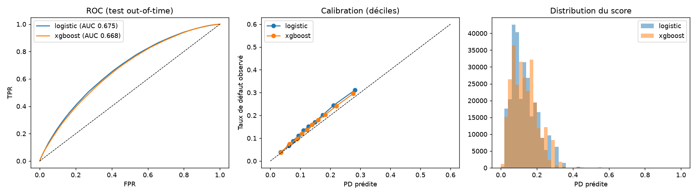

# Rapport de validation — Lending Club (protocole out-of-time)

**Date** : 2026-09-22 · **Jeu de données** : [Lending Club, Kaggle](https://www.kaggle.com/datasets/wordsforthewise/lending-club)
(CC0-1.0) · **Pipeline** : `make ingest && make benchmark` (voir `dvc.yaml`, ADR 0001-0003)

## Ce que ce rapport prouve, et ce qu'il ne prouve pas

Il valide la **méthode** (split temporel réel, baseline honnête, calibration, sélection par
preuve statistique) sur des données de crédit réelles. **Il ne dit rien de la performance
attendue sur le portefeuille CIF** : Lending Club est du crédit à la consommation américain
entre particuliers (2009-2015), pas de la microfinance ouest-africaine.

## Périmètre et découpage

| Split | Prêts | Taux de défaut | Période |
|---|---|---|---|
| Entraînement | 172 430 | 12,47 % | 2009-01 → 2013-12 |
| Validation | 162 570 | 13,73 % | 2014-01 → 2014-12 |
| Test (out-of-time) | 283 026 | 14,89 % | 2015-01 → 2015-12 |

Prêts à 36 mois uniquement, statut terminal (remboursé ou perte), sur un fichier arrêté au
T4 2018 : tous ces prêts ont eu le temps d'arriver à échéance (label mature, voir ADR 0001).
`grade` / `sub_grade` / `int_rate` (score interne du prêteur) sont exclus (ADR 0002). 18
features calculées à la date d'octroi, sans aucune colonne d'après-octroi (liste blanche +
contrat Pandera bloquant, voir `src/data/lending_club.py`).

Le test n'a été évalué **qu'une seule fois**, après le choix des hyperparamètres et de la
calibration sur les autres splits.

## Résultat : la baseline l'emporte

| Métrique (test 2015) | Logistique (baseline) | XGBoost (contraint, tuné) |
|---|---|---|
| ROC-AUC | **0,6746** [IC95 % 0,6721–0,6774] | 0,6678 [0,6653–0,6705] |
| Gini | 0,349 | 0,336 |
| KS | 0,252 | 0,244 |
| PR-AUC | 0,249 | 0,243 |
| Brier | 0,1211 | 0,1213 |
| ECE | 0,0201 | 0,0148 |

**Écart d'AUC (XGBoost − logistique), bootstrap apparié (200 réplications)** : moyenne
−0,0068, IC95 % **[−0,0082 ; −0,0056]** — exclut 0 du côté négatif. XGBoost est démontrablement
**moins bon**, pas seulement équivalent.

**Champion retenu : régression logistique** (ADR 0003 : le modèle complexe n'est promu que si
l'IC95 % exclut 0 en sa faveur ; ici c'est l'inverse). XGBoost reste mieux calibré nativement
(ECE 0,015 contre 0,020), mais l'écart disparaît après calibration isotonique des deux modèles.



## Lecture du résultat

Un AUC de 0,67 est un ordre de grandeur plausible pour du crédit à la consommation scoré
**sans** utiliser le score du prêteur — cohérent avec la littérature publique sur ce jeu de
données dans les mêmes conditions. Que la baseline batte un XGBoost pourtant tuné (30 essais
Optuna, validation croisée temporelle, contraintes de monotonicité) n'est pas un échec : c'est
le résultat attendu quand le signal est majoritairement linéaire et le volume d'entraînement
modeste au regard du nombre de features. C'est aussi la preuve que le protocole de sélection
fonctionne : il retient le modèle le plus simple et le plus explicable quand rien ne justifie
la complexité, au lieu de publier XGBoost par défaut.

## Reproduire

```bash
pip install -e ".[dev,data]"
make data-download   # nécessite un jeton API Kaggle, voir data/README.md
make pipeline         # make ingest && make benchmark
cat reports/lending_club/metrics.json
```

## Prochaine étape

Servir le champion (logistique) dans l'API de démonstration à la place du XGBoost synthétique,
avec seuils fixés par coût (`src/evaluation/thresholds.py`) plutôt qu'à la main, et explications
par variable. Réentraîner sur données CIF dès qu'elles existent, via le même pipeline.
