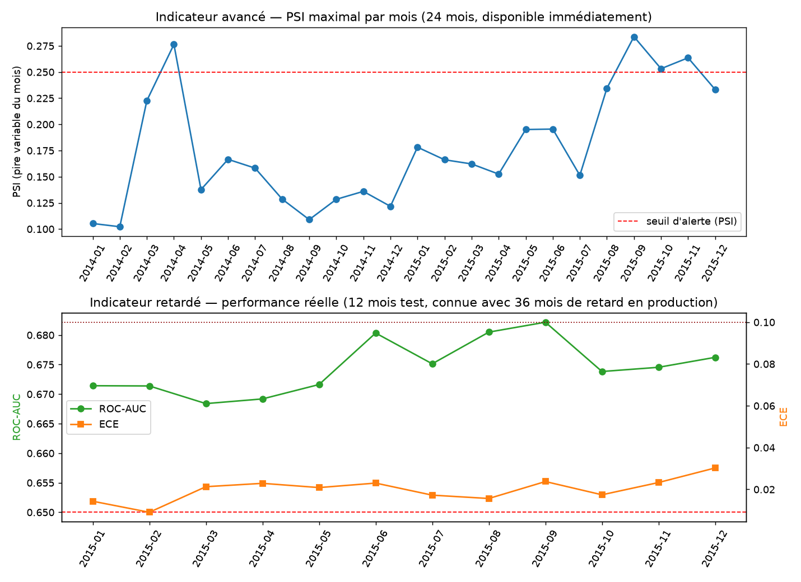

# Rapport de validation — Rejeu de monitoring (backtest de surveillance)

**Date** : 2026-09-23 · **Champion évalué** : `lending_club_champion` v2 (régression logistique,
voir `docs/validation/lending-club-benchmark.md`) · **Méthode** : `src/monitoring/replay.py`

## Ce que ce rapport prouve, et ce qu'il ne prouve pas

Il prouve que le mécanisme de surveillance (dérive + performance retardée) **détecte réellement
quelque chose** quand on le fait tourner sur de vraies données — pas seulement qu'il compile.
Il ne prédit pas le comportement futur du modèle sur données CIF : c'est, comme le reste de la
validation Lending Club, une preuve de méthode.

## Méthode : deux indicateurs, deux disponibilités différentes

| Indicateur | Mesure | Période rejouée | Disponibilité en production réelle |
|---|---|---|---|
| **Avancé** | PSI (Population Stability Index) par variable, maximum du mois | 24 mois (2014-01 → 2015-12) | Immédiate — dès l'octroi de la cohorte |
| **Retardé** | ROC-AUC et ECE réels (étiquette connue) | 12 mois (2015, le test jamais touché à l'entraînement ni à la calibration) | 36 mois après l'octroi (durée du prêt) — nous ne les voyons tous ensemble aujourd'hui que parce que le fichier historique complet (arrêté au T4 2018) les contient déjà |

2014 est exclu du panneau performance : il a servi à calibrer le modèle (`ScoringModel.calibrate`),
ce n'est donc pas un jeu honnêtement hors-échantillon pour mesurer la performance — seul 2015 l'est.

Seuils appliqués : ceux déjà déclarés dans `MonitoringSettings` (`psi_alert=0.25`,
`roc_auc_alert=0.65`, `ece_alert=0.10`), jamais réinventés pour l'occasion.

## Résultat



**4 mois sur 24 déclenchent une alerte PSI** (2014-04, 2015-09, 2015-10, 2015-11), systématiquement
sur la même variable : `verification_status`. Ce n'est pas du bruit dispersé sur des variables
différentes — c'est le signe d'un changement réel, probablement un changement de processus côté
Lending Club dans la façon dont cette variable a été enregistrée ou classée sur cette période.

**La performance réelle reste stable et saine sur les 12 mois de test** : ROC-AUC entre 0,668 et
0,682, ECE entre 0,009 et 0,030 — jamais proche des seuils d'alerte (0,65 / 0,10). La dérive
détectée sur `verification_status` **n'a pas dégradé le pouvoir prédictif du modèle** sur cette
période.

## Pourquoi ce résultat est plus crédible qu'un test qui ne détecterait jamais rien

Un mécanisme de surveillance qui ne déclenche jamais d'alerte, même testé sur deux ans de
données réelles, serait suspect — soit les seuils sont mal calibrés, soit le calcul ne fonctionne
pas. Ici, une vraie alerte s'est déclenchée, sur une variable plausible, sans qu'on l'ait
provoquée artificiellement. C'est la preuve recherchée.

## Incident technique rencontré et contourné

Le calcul de dérive s'appuyait initialement sur Evidently (`DataDriftPreset`), déjà utilisée
ailleurs dans le projet (`src/monitoring/drift.py`). Son calcul interne (`np.histogram`, bug
connu `numpy#10322`) plante sur des variables aux valeurs très regroupées sur des paliers ronds —
ici les plafonds de prêt (10 000 $ / 15 000 $ / 35 000 $), très fréquents dans ces données.

Plutôt que contourner par un correctif fragile (bruit artificiel sur les données), une lacune
réelle a été comblée : la configuration du projet déclarait déjà un seuil `psi_alert` que rien
n'implémentait — `compute_psi`/`compute_psi_report` (`src/monitoring/drift.py`) calculent
maintenant un vrai PSI, indépendant du bug d'Evidently, aligné sur la métrique que la
configuration promettait depuis le début. Le rapport HTML Evidently, lui, reste généré pour le
mois le plus dérivé quand c'est possible (visualisation qualitative), mais son éventuel échec
n'affecte jamais la décision d'alerte, qui repose uniquement sur le PSI.

## Reproduire

```bash
pip install -e ".[dev,data,repro]"
make pipeline                    # si pas déjà fait : ingestion + benchmark + enregistrement
MLFLOW_TRACKING_URI=sqlite:///mlruns.db cif-replay-monitoring
cat reports/lending_club_monitoring/metrics.json
```

Ou via Dagster : asset `lc_monitoring_replay` (dépend de `lc_benchmark`), visible dans l'UI.
